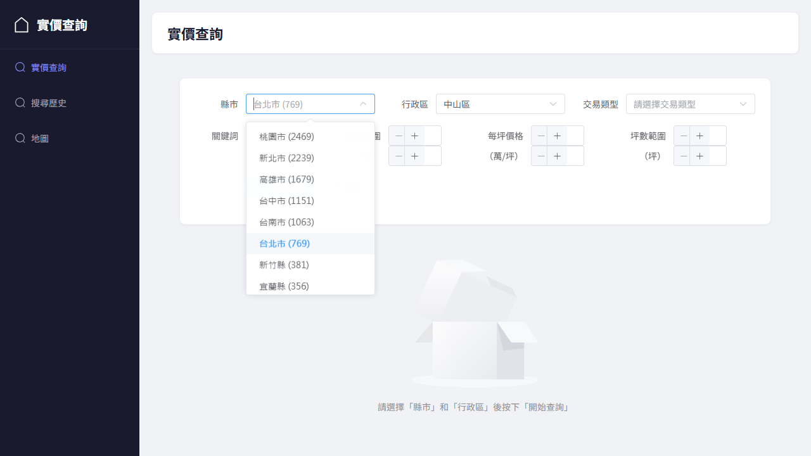
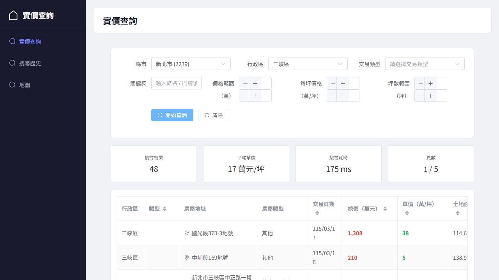
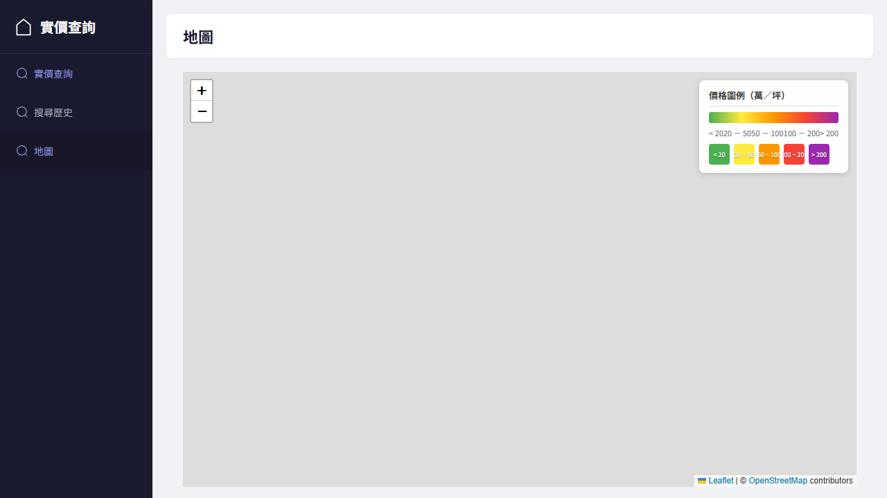

# 實價登錄 SPA 測試報告

## 最新執行結果（2026-05-13）

| 分類 | 測試檔案數 | 測試數 | 通過 | 失敗 |
|------|-----------|--------|------|------|
| Unit | 3 | 52 | ✅ 52 | 0 |
| Data Integrity | 4 | 57 | ✅ 57 | 0 |
| Playwright E2E | 3 | 9 | ✅ 9 | 0 |
| **合計** | **10** | **118** | ✅ **118** | **0** |

---

## Unit + Data Integrity（`npm test`）

```
 RUN  v4.1.5

 Test Files  7 passed (7)
      Tests  109 passed (109)
   Start at  14:20:00
   Duration  5.14s
```

### 測試分佈

| 檔案 | 說明 |
|------|------|
| `tests/unit/city-map.test.js` | CITY_MAP / REVERSE_CITY_MAP 一致性 |
| `tests/unit/date-format.test.js` | formatDate / formatPrice / transformRecord |
| `tests/unit/store.test.js` | Pinia realEstate store actions / computed |
| `tests/unit/landPrice.test.js` | getCities / getDistricts / searchLandPrice 參數映射 |
| `tests/data-integrity/city-coverage.test.js` | 21 縣市 API 覆蓋率（需 dataServer） |
| `tests/data-integrity/empty-result.test.js` | 空結果回應格式 |
| `tests/data-integrity/pagination.test.js` | 分頁一致性驗證 |

---

## Playwright E2E（`npx playwright test`）

```
Running 9 tests using 3 workers

  ok  搜尋頁面 › should display search form on page load        (1.2s)
  ok  搜尋頁面 › should show cities in dropdown                 (1.1s)
  ok  搜尋頁面 › should search and display results              (1.5s)
  ok  搜尋頁面 › should apply price filter                      (1.4s)
  ok  搜尋頁面 › should handle pagination                       (1.4s)
  ok  地圖模式 › should switch to map mode                      (1.3s)
  ok  地圖模式 › should display heatmap control                 (3.3s)
  ok  搜尋歷史 › should navigate to history page                (1.4s)
  ok  搜尋歷史 › should show empty state when no search history (0.9s)

  9 passed (11.5s)
```

### E2E 截圖（`screenshot: 'on'`，每個測試完成時自動擷取）

#### 搜尋頁面

| 測試 | 截圖 |
|------|------|
| should display search form on page load |  |
| should show cities in dropdown |  |
| should search and display results |  |
| should apply price filter |  |
| should handle pagination |  |

#### 地圖模式

| 測試 | 截圖 |
|------|------|
| should switch to map mode |  |
| should display heatmap control |  |

#### 搜尋歷史

| 測試 | 截圖 |
|------|------|
| should navigate to history page |  |
| should show empty state when no search history |  |

---

## 資料庫

- 位置：`data/realdb/lvr_data.db`（不進 git，需執行 `python build_db.py` 重建）
- 本次重建筆數：**11,868 筆**
- 資料來源：`data/lvr_txt/`（21 縣市、a–x 代碼）
- 重建指令：`python build_db.py`

---

## 已修正的已知問題

| 問題 | 修正說明 |
|------|----------|
| 行政區 select 在縣市有預設值時仍 disabled | `SearchView.vue` 改用 `:disabled="!form.county"` |
| E2E 測試使用 `waitForTimeout`，不穩定 | 全部改為顯式等待（`toBeVisible`、`not.toBeDisabled`） |
| 地圖 E2E 等待 Leaflet 初始化超時 | 新增 `LEAFLET_TIMEOUT = 15000` |
| `HistoryView` 無資料時顯示雙重空狀態 | `el-table` 加 `v-if`，`el-empty` 改 `v-else` |
| `city-map.test.js` 臺東縣字元不一致 | `台東縣` → `臺東縣`，與 `landPrice.js` 一致 |
| `tests/` 根目錄有 6 個歷史遺留腳本 | 全部刪除 |
| `DESIGN.md` 第 10 節為佔位符內容 | 填入實際限制與已知問題 |
| `vite.config.js` 有不必要的 `historyApiFallback` | 已移除 |

---

## 測試分類說明

| 分類 | 位置 | 依賴服務 |
|------|------|----------|
| Unit | `tests/unit/*.test.js` | 無（使用 mock） |
| Data Integrity | `tests/data-integrity/*.test.js` | `dataServer.js`（由 `globalSetup.js` 自動啟動） |
| Playwright E2E | `tests/e2e/*.spec.js` | Vite + dataServer（由 `playwright.config.js` 自動啟動） |

## 執行指令

```bash
# 建立資料庫（首次或乾淨 clone 後）
python build_db.py

# Unit + Data Integrity 測試
npm test

# E2E 測試（自動啟動 Vite + dataServer）
npx playwright test
```
